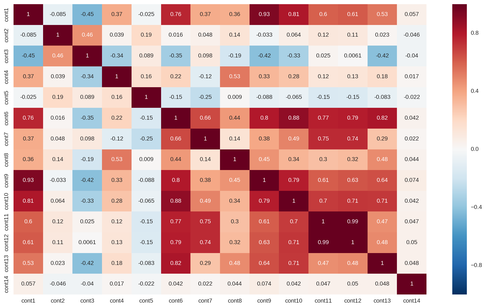
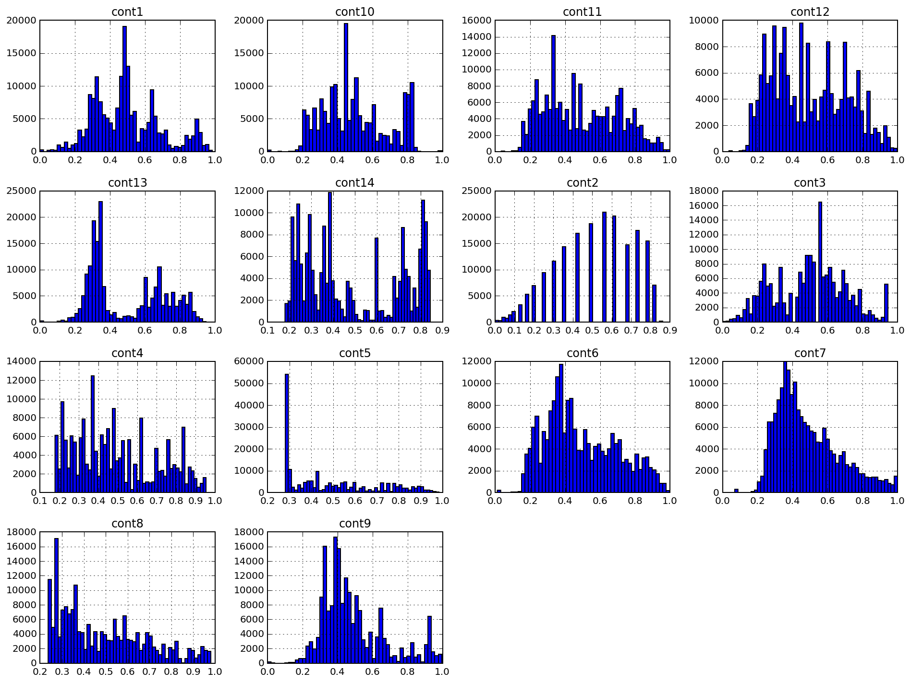
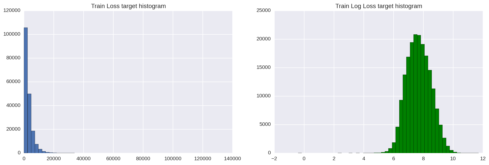
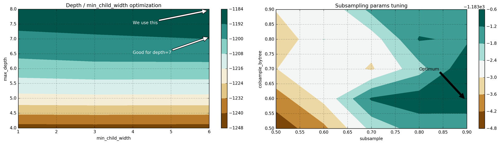

# Allstate Claims Severity Capstone Report

## Part 1. Project Definition

### Project Overview

A lot of people working in data-related fields heard of Kaggle: a platform for running data science competitions. Currently Kaggle features [more than 600K data scientists](https://www.kaggle.com/host/business) and dozens of well-known companies. A company defines its problem, quality metrics, publishes a dataset which may help solve it — and participants show off their creativity in solving company's problem.

This Kaggle competition is brought by Allstate, the largest publicly held personal lines property and casualty insurer in America. Allstate is currently developing automated methods of predicting the cost (severity) of insurance claims and asked kagglers to demonstrate some fresh ideas and approaches to this problem. 

The company strives to improve its claim service and published a dataset of accidents happened to households (each is represented as a row of anonymized features belonging to this household) with a numerical metric of the cost of this claim. Our task is to predict how severe the claim will (or might) be for a new household.

There are several related datasets that are also available on Kaggle:

* [Allstate Claim Prediction Challenge](https://www.kaggle.com/c/ClaimPredictionChallenge): an earlier competition from Allstate featuring the goal to predict insurance payments based on the characteristics of the insured's vehicle. This dataset offers an opportunity to dive into the insurance domain.
* [Fire Peril Loss Cost](https://www.kaggle.com/c/liberty-mutual-fire-peril): a competition from Liberty Mutual Group featuring the prediction of expected fire losses for insurance policies. This is another example of a dataset from the insurance domain to help us gain insights on the approaches to solve prediction tasks in insurance industry.

I note that the original dataset is highly anonymized (both feature names and values) and this aspect makes it excessively hard to understand features as well as to enrich the data with external datasets. Several attempts have been made so far, but their success is debatable. On the other hand, this dataset does not seem to have [data leaks](https://www.kaggle.com/wiki/Leakage) occurring when additional information remains in training data. This information may highly correlate with the target and lead to unreasonably good predictions. Lately, a substantial number of challenges on Kaggle suffered from such leakages.

### Problem Statement

We are provided with a dataset which contains claim records of Allstate clients. A record contains both categorical and continuous features. The target feature is just the numerical loss that this claim caused. All the features are extremely anonymized: we don't either know the real names of the features or their true values. 

Our aim is to build up a model that can correctly predict the future loss based on the given features. This is clearly a regression problem: our target variable is numerical. This is also a supervised learning task: our target variable is explicitly defined in the training set, we are expected to provide its value for the records in the test set.

Allstate did a really good job with data preprocessing and cleansing: our dataset is very clean and (after a small extra work) can be fed into many supervised learning algorithms. As we see in the data exploration part, Allstate's challenge does not provide many opportunities for feature engineering or advanced data preprocessing. On the other hand, this dataset encourages using and tesing various ML algorithms and ensembles — this is exactly what we do in Capstone.

I came to the following strategy to approach Allstate Claims Severity Challenge:

1. Explore the dataset, understand the data, features, target variable and find basic relationships in data. This is accomplished in [Data Discovery notebook](part1_data_discovery.ipynb).
2. Do necessary data preprocessing and train several different ML algorithms (XGBoost and multilayer perceptron). Get a baseline score. This is accomplished in [XGBoost](part2_xgboost.ipynb) and [MLP](part3_mlp.ipynb) notebooks.
3. Tune each model and get a noticable score improvements for each of them. This is  accomplished in the XGBoost and MLP notebooks as well.
4. Train an ensemble using the stacking technique with previous models as base predictors. Get the final score which is considerably better than the previous one. This is accomplished in [Stacking notebook](part4_stacking.ipynb).
5. Briefly discuss the results, evaluate the final score and find more ways to improve it. This is accomplished later in this report and in the last part of [Stacking notebook](part4_stacking.ipynb).

### Metrics

Kaggle platform requires a company that runs a competition, define a clear quality metric participants can compete on. Allstate competition features [MAE](https://en.wikipedia.org/wiki/Mean_absolute_error) as a metric. MAE (mean absolute error) is a very simple and obvious metric that directly compares the predicted value with the ground truth.


This metric is given and cannot be changed since it is a part of the competition. Nevertheless, I consider it well-suited to this problem. First, MAE (in contrast with MSE/RMSE) does not severely penalize our model for not identifying outliers (there are a few outliers with extreme loss values). Second, MAE can be easily described: it is just a loss itself, not some "unit" that should be optimized. Generally speaking, MAE is a good metric for data science novices. It is easily calculated, simple to understand and hard to be misinterpreted.

## Part 2. Analysis

### Data Exploration

**Please, see the full data exploration in the notebook [Data Discovery](part1_data_discovery.ipynb).**

The whole training dataset consists of **188318 samples** indexed by  `id`. Index provides little information since it is just an increment starting from "1" with some values omitted. We are not going to use the unlabeled test set for predictions (it is used for Kaggle submissions), but it is worth noting that the test dataset is distributed the same way the train set does. Obviously, train and test were made from one dataset using a routine like `train_test_split` from `sklearn` package.

Key highlights from the data exploration part:

- There are 130 distinct features (not counting `id` and `loss`). This is a very reasonable amount of features considering the size of dataset. We may hardly face the curse of dimensionality.


- 116 of the features are categorical, 14 are numerical. We may have to encode these 116 features since most ML algorithms cannot correctly process categorical features. The ways of encoding and the difference among them will be discussed later on.
- There is no missing values in the whole dataset. This fact also proves that Allstate provided highly preprocessed data to make it friendly and easy to use.


- A majority of categorical features (72 or 62%) are binary (yes / no; male / female), but their values are just "A" or "B", so we cannot guess their meaning. 3 features have three distinct values, 12 features have four different values.


- Numerical features are already scaled to [0, 1] range, their standard deviations are all close to 0.2, means are around 0.5,  thus we cannot guess their meaning either.


- Seems like several numerical features had been categorical before being converted to numerical via `LabelEncoder` or a similar routine.


- Due to this conversion, numerical features do not follow simple PDFs (probability density functions). We may try to reduce the skew of this data (for `scipy.stats.mstats.skew > 0.25`), but I do not expect much performance gain after this.


- Target feature is not normally distributed either, though it can be easily log-transformed to achieve a distribution close to Gaussian.


- Target feature contains a few extreme outliers (very serious accidents). Ideally, we want our model detect and predict these outliers. At the same time, we can easily overfit if we are not careful enough. Clearly, there should be a tradeoff here.


- Train and test set have a similar data distribution. This is an ideal characteric of train-test split which greatly simplifies cross-validation and allows us make informed decisions about the quality of models using cross-validation on training set. It greatly simplified my Kaggle submissions, but it won't be useful in Capstone.


- Several continuous features are highly correlated (the correlation matrix is plotted on Figure 1 below). This leads to data-based multicollinearity in dataset which can drastically reduce the predictive power of linear regression models. L1 or L2 regularization can help reduce this problem.


*Figure 1: Continuous features correlation matrix*

### Exploratory Visualization

I provide one visualization to show off the an important characteric of this dataset, which is highly anonymized, preproccessed and obfuscated data.

Below is a histogram of 14 continuous features, labeled as `cont#`. As we see on Figure 1, the data distributions have many spikes and PDFs are not close to Gaussian. We can try to reduce the skew of the data, but running normalization algorithms (e.g. [Box-Cox](http://onlinestatbook.com/2/transformations/box-cox.html)) resulted in few substantial benefits for this dataset.

*Figure 2: Continuous features histogram*

`cont2` is a feature of a special interest. This feature has been seemingly converted from a categorical one and may represent age or age category. Unfortunately, this is still unclear and had no impact on my project yet.

### Algorithms and Techniques

**Two notebooks describe this section in a much greater detail: [XGBoost notebook](part3_xgboost.ipynb) and [MLP notebook](part2_mlp.ipynb).**

**XGBoost**. One of my motivations was to test boosted trees approach and specifically XGBoost. This algorithm became a de-facto standard swiss knife for many Kaggle competitions due to its scalability, flexibility and an amazing predictive power.

[XGBoost (Extreme Gradient Boosting)](https://xgboost.readthedocs.io/en/latest/) is suitable for supervised learning problems similar to the one we have (a well-defined training dataset and a target feature). We describe the intuition behind XGBoost below.

Generally speaking, XGBoost is a variation of boosting, a machine learning ensemble meta-algorithm for reducing bias and variance in supervised learning, and a family of machine learning algorithms which convert weak learners to strong ones. Source: [Wikipedia on boosting](https://en.wikipedia.org/wiki/Boosting_(machine_learning)). Original boosting ideas are rooted in the question posed by Kearns and Valiant of whether a “weak” learning algorithm which performs just slightly better than random guessing in the PAC (distribution-free or probably approximately correct) model can be “boosted” into an arbitrarily accurate “strong” learning algorithm. Source: [A Short Introduction to Boosting](https://cseweb.ucsd.edu/~yfreund/papers/IntroToBoosting.pdf)  (Yoav Freund and Robert E. Schapire). This question has been affirmatively answered by R.E.Schapire in his paper [The Strength of Weak Learnability](http://www.cs.princeton.edu/~schapire/papers/strengthofweak.pdf) which led to the development of many boosting algorithms.

As we see, the intuition behind boosting is to build weak learners sequentially. Each next weak learner tries to reduce the bias of the whole combined estimator, thus combining weak learners into a powerful ensemble model. There are various examples of boosting algorithms and techniques, including AdaBoost (adaptive boosting which adapts to the weak learners), LPBoost and gradient boosting.

Specifically, XGBoost is a library which provides the gradient boosting framework. Gradient boosting model is built in a stage-wise fashion like other boosting methods do. This boosting technique generalizes weak learners by allowing optimization of an arbitrary differentiable loss function (the loss function with a calculable gradient).

> XGBoost, as a variation of boosting, features a novel tree learning algorithm for handling sparse data; a theoretically justified weighted quantile sketch procedure enables handling instance weights in approximate tree learning. 
> Source: *[XGBoost: A Scalable Tree Boosting System](http://dmlc.cs.washington.edu/data/pdf/XGBoostArxiv.pdf) (Tianqi Chen, Carlos Guestrin)*

There is a number of advantages of XGBoost:
* Regularization. It is easy to build an overfitted model for other algorithms as it will be shown in MLP notebook. XGBoost provides very solid regularization out-of-the-box and has many options of controlling regularization. They include: `gamma` (minimum loss reduction to split a node further), `alpha` (L1 regularization term on weights), `lambda` (L2 regularization term on weights), `max_depth` (maximum depth of a tree), `min_child_weight` (minimum sum of weights of all observations required in a child).

* Parallel and distributed implementation. Unlike many boosting algorithms, training can be done in parallel, thus reducing training time. XGBoost is really fast. Authors of the above mentioned paper state: *"The system runs more than ten times faster than existing popular solutions on a single machine and scales to billions of examples in distributed or memory-limited settings."*.

* Built-in cross-validation. CV is essential for any reasonable model evaluation and cross-validating XGBoost models is trivial.

**MLP**. The second model we build is a feedforward, fully-connected neural network, or a multilayer perceptron. Since the final goal is to build a stacker of base regressors (and we defined the first type — XGBoost), we need to find a different "type" of a generalizer which explores the dataset in a different way. 
> This is part of what is meant by saying that the level 0 generalizers should “span the space”. [Wolpert, Stacked Generalization](http://www.machine-learning.martinsewell.com/ensembles/stacking/Wolpert1992.pdf).

By adding more layers and more units within a layer, neural networks can capture very complex nonlinear relationships in data. [Universal approximation theorem](https://en.wikipedia.org/wiki/Universal_approximation_theorem) states that a feedforward neural network can approximate any continuous function in Euclidean space. Thus, MLP is a very powerful modelling algorithm. MLPs are easily overfitted, but we are provided with all neccessary tools to reduce it: dropout, L1-L2 regularization, batch normalization, etc. We can also fit several similar neural networks and average their predictions.

Deep learning community developed very quality software to train and evaluate models based on artificial neural networks. My models are built on top of [TensorFlow](https://www.tensorflow.org/), a library for numerical computations, developed by Google. To make things simpler, I decided to use [Keras](https://keras.io/), a high-level frontend for TensorFlow and Theano which abstracts most of the standard work for training a neural network.

**GridSearch and Hyperopt**. These are methods for model selection and hyper-parameters tuning. While Grid Search exhaustively iterates over all possible parameter combinations, Hyperopt either samples a given number of candidates from a parameter space with a given distribution, or uses a form of Bayesian optimization called Tree of Parzen Estimators (TPE). For both methods of model selection, we use cross-validation as a technique of performance evaluation. We'll use a k-fold CV with three or five folds depending on a computational complexity of the model.

**Stacking**. We combine predictions of two of our models (XGBoost and MLP) in the final prediction using a metaregressor. This technique is called stacking and is heavily (ab)used on Kaggle. The basic idea is to fit a simple metamodel on out-of-fold predictions of our base estimators. Then, the fitted metamodel makes the final prediction over the dataset of base estimators' test set predictions. This is implemented in detail in [Stacking notebook](part4_stacking.ipynb).

### Benchmark

The first benchmark is the one that was set by Allstate: they trained a Random Forest ensemble model and got the score `MAE=1217.52141`. This score is easy to beat even with a simple XGBoost model — and the majority of participants did. 

There are benchmarks I set when I trained models. My benchmark is a performance of a simple model of its class. For XGBoost, a benchmark is set to `MAE=1219.57`, the loss of a simple 50-tree model without any optimization or hyper-parameters tuning. I took default hyper-parameters values (as suggested in [Analytics Vidhya post](https://www.analyticsvidhya.com/blog/2016/03/complete-guide-parameter-tuning-xgboost-with-codes-python/)), kept the number of estimators low and got this initial score.

For MLP, the benchmark is the performance of 2-layer model with a small amount of units in hidden layer (128) with ReLU activation, default weight initialization and Adam GD optimizer: `MAE=1190.73`.

For this Capstone, I avoid setting too difficult baselines since I understand that all the results should be reproducible. I also participate in this Kaggle competition, but it will surely take too much time for the reviewer to train all my production models, most of which are bagged and stacked, and use more estimators. In Kaggle, I hope to beat the score `MAE=1100`.

## Part 3. Methodology

### Data Preprocessing

I mentioned that the dataset had already been  well-prepared and preprocessed, e.g., continuous features had been scaled to [0,1], categorical features had been renamed, their values set to numbers. Actually, there is not that much left to preprocess, but some work is required in order to train adequate models.

#### Target variable preprocessing
Our target feature is exponentially distributed which can lower the score of our regression models. As we know, regression models work best when the target feature is normally distributed.

To solve this problem, we can simply log-transform loss: `np.log(train['loss'])`.


*Figure 3: Initial and log-transformed target feature histograms*

This can be improved even more: there are several outliers to the left of the bell curve. To remove them, we can shift all values from `loss` 200 points right (`loss+200`) and take the logarithm afterwards.

#### Label and one-hot encoding of categorical features

Most ML algorithms do not directly work with categorical features. XGBoost is not an exception, so that we have to convert our categorical features to numbers. We can choose between two standart strategies: label encoding and one-hot encoding. It is quite [debatable](https://github.com/szilard/benchm-ml/issues/1) which strategy to use, but there are several points to consider:

**One-hot encoding** is a default way to deal with categorical features. It outputs a sparse matrix where each new column represents one possible value of one feature. Since we have 116 categorical features, `cat116` has 326 values, we may get a sparse matrix with lots of zeros. This results in a longer training time, more memory requirements and may even lower our score. Another disadvatage of one-hot encoding is the information loss when the order of a categorical values matter.

**Label encoding**, on the other hand, [just normalizes the input column](http://scikit-learn.org/stable/modules/preprocessing_targets.html#label-encoding) the way that it contains only values between 0 and num_classes-1. This is not a good strategy for many regression algorithms, but XGBoost [can and does handle](https://www.kaggle.com/c/allstate-claims-severity/forums/t/24646/sparse-matrix-and-xgboost) such a transformation very well.

For XGBoost we are going to use `LabelEncoder` and normalize input. For MLP we have to create dummy features, thus, One-hot encoder is the way to go.

### Implementation and refinement

As I mentioned earlier, our implementation methodology will be divided into two sections:

* Train, tune and cross-validate base estimators (L0-models): XGBoost and MLP, provided we have already done our data preprocessing which is slightly different for each model. The difference is in feature encoding (one-hot vs label encoding) and (unfortunately) the lack of log-transformation of target feature for MLP. The result of this section will be two tuned models with adequate scores.


* Train and validate the L1-model which is our stacker. The result of this section will be the new metamodel which scores better than any of the base L0-model we trained earlier.

Now it is time to get a detailed overview of each section.

#### Section 1. L0-models: training, tuning, cross-validation

**Methodology for training XGBoost model** (adapted from [Analytics Vidhya guide to XGBoost tuning](https://www.analyticsvidhya.com/blog/2016/03/complete-guide-parameter-tuning-xgboost-with-codes-python/)):

1. Train a shallow and simple model with `num_boost_round=50, max_depth=5`  and get a baseline score of `MAE=1219.57`. We are going to set this as the lower margin of the score and improve it with model tuning.
2. To facilitate hyper-parameters tuning, we implement a custom `XGBoostRegressor` class for wrapping XGBoost. This is not strictly required, but it will provide us benefits (we can use a custom evaluation function or the option to minimize the function instead of maximizing) while using `GridSearchCV` grid search implemented in scikit-learn.
3. We define and fix the learning rate and the number of estimators to be used in the next grid search. Our priority is to keep the training time and the running time of grid search at minimum. `eta=0.1, num_boost_round=50`.
4. Tuning `max_depth` and `min_child_weight`. These hyper-parameters are recommended to be tuned together since the increase in `max_depth` increases the complexity of model (and chances of overfitting). At the same time, `min_child_weight` works as a regularization parameter. We get the following best results: `max_depth=8, min_child_weight=6`. We improve our score from `MAE=1219.57` to `MAE=1186.5`.
5. Tuning `gamma`, a regularization parameter.
6. Tuning the ratio of features and training examples to be used for each tree: `colsample_bytree`, `subsample`.  We find an optimum: `subsample=0.9, colsample_bytree=0.6` and our score is improved to `MAE=1183.7`.
7. Finally, we add more estimators (increase `num_boost_round`) and decrease the learning rate `eta`. We also develop rule of thumb for understanding relationship between these two hyper-parameters. Our final model uses 200 trees, has `eta=0.07` and the final score is `MAE=1145.9`.

An example of the tuning process via Grid Search is pictured on Figure 3 below (see [notebook](part2_xgboost.ipynb) for details):


*Figure 4: 2D hyper-parameters space for max_depth–min_child_weight; colsample-subsampling*

**Methodology for training MLP model:**

1. Start simple and build a basic model with a single hidden layer (2-layer model), ReLU activation function, Adam gradient descent optimizer. Such shallow models do not get overfitted easily, they are fitted fast and provide a good initial score. In terms of [bias-variance tradeoff](http://nlp.stanford.edu/IR-book/html/htmledition/the-bias-variance-tradeoff-1.html), they represent biased models, though they are stable and provide a decent score `MAE=1190.73` for this simple model.
2. Introduce k-fold cross-validation to measure performance of deeper models as well as to visualize overfitting. Train a 3-layer model, show that it can be easily overfitted.
3. Add regularization to the 3-layer model: dropout and early stopping. Define several possible configurations to be manually tested: these configurations differ in the number of hidden units and dropout rates. Train these models, see and compare their CV scores and pick the best performing one. Actually, we are not going to perform better with this approach: we get a worse score than for a 2-layer MLP. Such an outcome can be caused by a manual (thus inaccurate) approach to MLP regularization. We simply define some sane dropout rates for layers, but there is no guarantee that these rates are optimal.
4. Introduce Hyperopt to search the hyper-parameters space in an automated and smarter way (using `tpe.suggest`, trees of parzen estimators). Run several iterations of Hyperopt over multiple configurations of hyper-parameters with various dropouts, layer compositions and numbers of hidden units. Finally, we find out that it is better to use a 4-layer architecture (three hidden layers) with adadelta optimizer, batch normalization and dropout.

The final architecture of the MLP:

*Figure 5: The final architecture of MLP*

The CV score for this model: `MAE=1150.009`.

#### Section 2. L1-model training

We now have two trained and tuned L0-models: XGBoost and MLP. In this section we make a dataset of out-of-fold predictions of L0-models (with known true values) as well as the test set of L0-models predictions which will be used for the final assessment of metamodel's quality.

**Please, see the full ensembling process in the notebook [Stacking](part4_stacking.ipynb).**

The ensembing methodology I followed is described below:

* **Step 1. New training and holdout sets generation.** Since we avoid submitting results to Kaggle (and using their test set), we need to split the training set into two parts: train and holdout. Training subset will be used for generating k-fold predictions of L0-models while the holdout will be just used for the final performance evaluation for both L0-models and the metamodel.


* **Step 2: Splitting.** Split the training set into K folds which will be used for training L0-models.


* **Step 3: Out-of-fold predictions.** Fit each L0-model on K-1 folds, generate predictions for the other fold. Repeat the process for all K folds. In the end, we get predictions for the whole training set (for which we also have labels).


* **Step 4: Fitting on the entire training set.** We fit each L0-model on the whole training set and get predictions for the test set. We combine predictions into a dataset, in which each feature is prediction of a single L0-model.

* **Step 5: Training L1.** We fit L1-model on out-of-fold predictions, while using corresponding labels from the training set as labels for L1. After that, we obtain the final prediction from L1-model using our combine dataset of L0 predictions.

We choose `LinearRegression` as the L1-model since we need to be careful not to overfit the stacker. This model worked very well and considerably improved the score. After cross-validating both L0-models and the final ensemble prediction on holdout set, we get the following results:

```
MAE for XGB: 1149.19888471
MAE for MLP: 1145.49726607
MAE for stacker: 1136.21813333
```

The stacker's score `MAE=1136.21` is notably better than the score of the best model in our ensemble. Of course, it can be improved, but we tradeoff the predictive power for the decrease in training time in this project.

**Caveat:** this set of scores is calculated on the holdout subset, not via cross-validation. Thus, we are not allowed to directly compare CV scores with holdout scores. Nevertheless, the holdout subset is expected to have a similar data distribution to the whole training set. This is why we may say that the stacking indeed improved our performance.

As a sidenote, we may be curious how our L0-models are weighted in the stacker. In the linear regression, it's just a linear combination of weights and predictions:

`PREDICTION = 0.59 * XGB_PREDICTION + 0.41 * MLP_PREDICTION`

## Part 4. Results

### Model Evaluation and Validation

In order to evaluate our results, we train and validate our final models (single and stacked) on different subsets of dataset. Thus we may see how stable our models are and whether they provide a consistent score regardless of initial training set. For these purposes, we generalize our stacker from [Stacking notebook](part4_stacking.ipynb) in a class `modules/stacker.py` which shortcuts scoring our models with different seeds.

We train our L0 and L1-models on five different seeds and write down their scores in a dataframe. We then use `pd.describe` method to get aggregated statistics regarding each model's performance. Mean and standard deviation are the most distinctive metrics here:

| metric | mlp         | stacker     | xgb         |
| ------ | ----------- | ----------- | ----------- |
| mean   | 1138.644760 | 1129.915531 | 1143.589538 |
| std    | 1.752011    | 1.889794    | 2.325297    |
| min    | 1136.586960 | 1127.505238 | 1140.778078 |
| 25%    | 1137.451881 | 1128.518383 | 1141.327482 |
| 50%    | 1138.605778 | 1130.341770 | 1145.197159 |
| 75%    | 1139.512347 | 1131.046757 | 1145.232551 |
| max    | 1141.066834 | 1132.165510 | 1145.412418 |

As we see, our models are quite stable (std are low) and stacker always outperforms any other model. Its lowest score is better than the best score of the best model (`MAE=1132.165` vs `MAE=1136.59`).

**Another caveat:** I tried to train and validate models carefully, but there may still be a room for information leaks that left unnoticed. All models show score improvements, which can be a result of such a leak (but we trained only five models, `seed=0` might just provide worse results). Nevertheless, the final observations are still valid: **averaging several stackers trained on different seeds do improve the score**.

### Justification

Our baseline scores: `MAE=1217.52` (Random Forest from Allstate) and `MAE=1190.73` (MAE of a simple MLP). Our final model got **7.2%** improvement over the first score and **5.1%** improvement over the second one.

To measure the significance of these results,  we add each of those scores to our stacker scores list (the one we got in the previous section) and find out whether the baseline score can be called an outlier. Thus, if this baseline score can be considered an outlier, the difference between our final scores and the baseline is significant.

To run this test, we can calcucate IQR which is used for anomaly or outlier detection. We then calculate third quantile of data (Q3) and use the formula `Q3 + 1.5 * IQR` to set the upper score margin. Values higher than this margin are considered outliers. When we run this test, we clearly see that the both baseline scores are outliers. Thus, we may say that our stacker model considerably outperforms baselines.

```
for baseline in [1217.52, 1190.73]:
    stacker_scores = list(scores.stacker)
    stacker_scores.append(baseline)
    max_margin = np.percentile(stacker_scores, 75) + 1.5*iqr(stacker_scores)
    if baseline - max_margin > 0:
        print 'MAE =', baseline, 'is considered an outlier.'
    else:
        print 'MAE = ', baseline, 'is NOT an outlier.'
```
Output:

`MAE = 1217.52 is considered an outlier.`
`MAE = 1190.73 is considered an outlier.`

## Part 5. Conclusion

### Free-Form Visualization

In this free-form visualization, I am zooming out our view to look at the whole project as a single entity. There are two main models we trained and optimized: XGBoost and MLP. We made a number of steps, starting from the simplest model possible and ending with a tuned, more robust and sophisticated model. After that, we created out-of-fold predictions for our L1-model, linear regression, and used the stacking technique to combine predictions of L0-models. Finally, we validated the performance of the stacker and trained five variations of it. Averaging the scores of those five stackers, we got the final result: **MAE=1129.91**.


*Figure 6: Score improvement milestones*

Of course, we could have included even more models in our Level 0 or we could have made our stacker more complicated. One possibility of doing this is to train several completely different stackers and combine their predictions (for instance, using a linear combination of their scores) on a new level, Level 2.

### Reflection

#### End-to-end problem solution

The idea of this project was to work with a dataset where feature engineering is not required. This is actually nice, since it allows to focus on algorithms and their optimization rather than on data preprocessing and munging. Of course, I wanted to try out XGBoost and neural networks, and such a dataset could provide a good benchmark of my own performance compared to other Kaggle participants' scores. 

Even with these degraded models, we got a significant improvement over the baseline: **7.2%**. We compared the baseline with the final scores and made sure that our final score is indeed an improvement. 

#### Challenges

This project was not trivial though I demonstrated no special or creative approach to this dataset, like feature engineering, dimensionality reduction or data enrichment. Nevertheless, the computational compexity of models that was required at Kaggle, could become a major stopper during this Capstone project.

The main problem with this Capstone was in reproducibility of calculations. There was a number of prerequisites for this: the process of getting the result should be clear, the computations are expected to be deterministic (or, at least, with limited fluctuations) and reproducible in a reasonable amount of time on any modern hardware. As a result, I severely downgraded the performance of my production models and omitted several techniques completely (e.g., I skipped the bagging technique for XGBoost and MLP, though, they work much smoother when bagged). 

This project has been mostly made on AWS infrastructure: I used `p2.xlarge` GPU-compute instances for MLP (NVIDIA Tesla K80 GPU, 12 GB of GPU memory) and `c4.8xlarge` CPU-compute instances for XGBoost (36 vCPUs, 60 GB of memory). There are several sections of my project that require heavy computations:

* Grid Search. It takes a substantial amount of time to iterate through all grids in XGBoost section. On an ordinary PC it may take from one to two hours to calculate everything in XGBoost notebook.
* CV of MLP models. Unfortunately, there is no silver bullet for speeding up cross-validation of MLP training. We need to evaluate different models and CV is the most reasonable way to do it.
* Hyperopt. This is definitely the heaviest part of all the calculations. It took many hours to iterate through various combinations of hyper-parameters and find the appropriate one with Hyperopt.
* Generation of out-of-fold predictions for MLP and XGBoost.

The best way to reproduce my results would be to run pretrained models first and recalculate some of the lighter models afterwards.

### Improvement

There is a lot of room for a further improvement. Let me suggest some improvements for all the parts of this project.

#### Data preprocessing

1. I started working on MLP-based models first, but I discovered the log-transform trick later on. As a result, my MLPs were trained on a non-transformed target and I decided to keep it this way. Of course, we can log-transform the target and retrain all MLP models.
2. A promising way to transform the target would be to shift it 200 points right (add 200 to all values in target). If we make this shift and then take the logarithm, we remove the outliers from the left side of target's PDF. Thus, we make this distribution more Gaussian-like.

#### XGBoost

1. Fit a more complex XGBoost model by adding even more estimators and reducing `eta` at the same time. My production model uses 28K trees and `eta=0.003` which has been found by Grid Search.
2. Use `early_stopping_rounds` instead of `num_boost_round` to stop training and keep the model from overfitting. In this case, we set `eta` to the a small number and make `num_boost_round` very large (up to 100K). This step is debatable since we need to prepare a validation subset. As a result, our model gets less data to train on and its performance may drop.
3. Run Grid Search on different values of hyper-parameters. Say, we could test `0 < colsample_bytree < 0.5` which often fruits good results. The idea is that there is a number of local optima in the hyper-parameters space and we should find several of these optima.
4. Ensemble several XGBoost models, trained with different hyper-parameters. This can be done by averaging the score of the models, blending and stacking.

#### MLP

1. Use bagging technique to average several MLPs from the same model. Our model is stochastic (e.g. we have dropout) and bagging will make it smoother and improve its predictive power.
2. Test deeper architectures, unit configurations and other hyper-parameters values. We can test out other GD optimizers, numbers of layers, amounts of units in each layer — the power of Hyperopt is in our hands.
3. Combine several different MLPs (say, train a 2-level, 3-level and 4-level neural network) using any of the techniques we now know. These models will span the space in a various fashion and provide an improvement over the basic score.

#### Cross-validation

Instead of using a basic 3-fold CV (sometimes we used 5-fold), we can switch to 10-fold CV. Of course, this is a Kaggle way of doing things, but it will improve our score (more data to train on).

#### Stacking

1. Adding more L0-models to our stacker. First, we can just train more MLPs and XGBoosts, though they should differ from one another. For example, we can train these models on different subsets of data, we can preprocess the data (`loss`) differently for some of them. Second, we may introduce completely different models: LightGBM, k-nearest neighbors, factorization machines (FMs), etc.
2. Add L2 as a new layer to stacking. To do this, we train more than one L1-stacker the way we did for a linear regression, and then we combine L1-models predictions on Level 2.
3. Use the PCA transformation we did in the Data Discovery part. There are several ideas. First, we take both components as metafeatures in L1 and fit linear regression on out-of-folds of XGBoost, PCA as well as on these PCA components. Second, we may select the features with the highest feature importances, do PCA transformation on these features only and include the resulted components in L1-model.